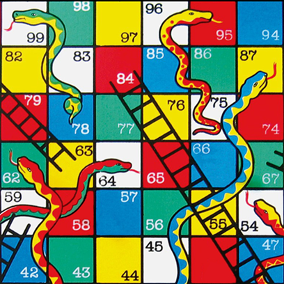

# snake-n-ladder

A simple console interface snake and ladder game created in C having both single and two players modes.

# **Snake and Ladder**

  

  Developed By Hizbi

## **Introduction:**

The Snake and Ladders game is originally an old Indian board game. It is usually played between two or more players. The basic mechanism involves starting at an initial position which is 1, rolling the dice, and getting to a higher position while avoiding the snakes but using the ladders, to ultimately reach the final position. The player who reaches to the end first wins the game.

## **Developing the Game in C:**

Writing a C version of this game is easy. First a board is generated which contains the all of the positions, from start till end. Then, each player is assigned the same initial position of 1. 

Rolling the dice is simulated by generating a random number between 1 and 6. The generated random number is added to each player's initial position, which gives the new position for each of them. This new position is checked for both players against a given blacklist of positions involving snakes and ladders, and upon matching the correct position in the blacklist, the player’s position is changed by either lowering it (eaten by snakes) or making it higher (climbing the ladders). Thus, the first player who reaches the final position is declared the winner and a message is shown congratulating the winner.

## **C Statements Used in This Game:**

Following statements were used in developing this game:

* ***printf*** : prompting the player with different messages.
* ***scanf*** : taking input from the user.
* ***switch()*** : switching between the single player and multiplayer mode.
* ***rand()*** : for generating a random number for simulating the working of rolling a dice.
* ***srand(time(0))*** : it basically resets the seed for the rand() so that each time when the rand() is called, it returns a different value. In this case, the seed is taken as the number of seconds from the system clock.
* ***while*** : this checks for whether anyone of the player has reached the final position or not. If a player reaches the final positions, it transfers the control to the printf statement which congratulates the winner. In this way it also acts as a conditional loop for repeating the program until a winner is declared.
* ***if else*** : this statement is used on multiple occasions to check for different conditions which control the flow of the whole game. Majorly used for making the snakes and ladders part of the game logic.

## **Data Types Used:**

Only integer data types are used for making this game. The integer data types are declared by using the int statement. These integers were used for storing the position of different players while also storing the random numbers generated by the rand() function. Values for case labels for switch statement were also stored in int data type.

## **Playing the Game:**

This game can be either played by a single player versus the computer, or by two players. The game first prompts the user for the game mode, i.e. Single Player or Multiplayer. Depending on the user’s choice, the game then loads the appropriate game mode.

For Single Player, the user only has to press “1” when prompted to roll the dice.  After that the user’s position and whether it was affected by snakes or ladders is displayed. Then the computer takes its turn and rolls the dice and respective information is displayed on the screen. The game continues until the final position “36” is achieved either by the user or by the computer.

For Multiplayer, the first player has to press “1” to roll the dice, while the second player has to press “2” to do the same. After rolling the dice, each player’s position is shown and it is displayed whether a player was bitten by a snake or used a ladder to climb up. At the end, the player who reaches the final position “36” first is congratulated and the game ends.

The game can be played again after it has exited by launching it from its “.exe” file.

  = = = = = = = = = = = = = = = = = = = = = = = = = = = = = = = = = = = = = = =

